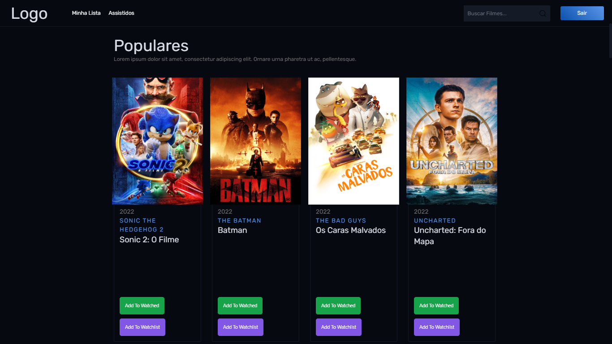
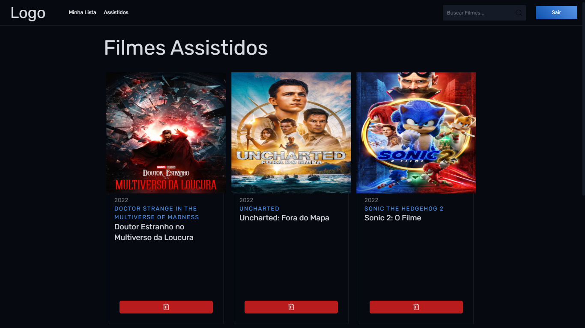
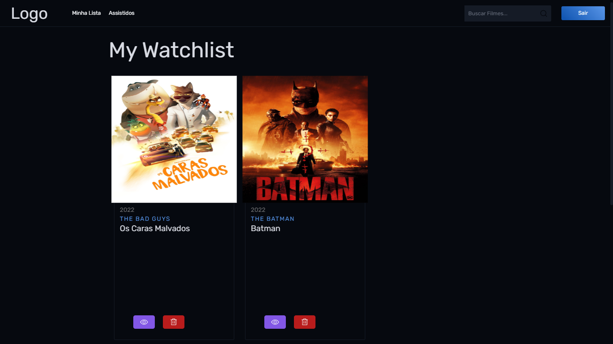

# Getting Started with Create React App

This project was bootstrapped with [Create React App](https://github.com/facebook/create-react-app).



    
    


## O Que Foi Utilizado no Sistema
* [ReactJS](https://pt-br.reactjs.org/)
* [Sass](https://sass-lang.com/)
* [TailWindCSS](https://tailwindcss.com/)

## Disponivel Em:
[CineFlix](https://cineflix-orcin.vercel.app/)

## Para Rodar o Sistema

1. Você deve Possuir um token da Api [The MovieDB](https://developers.themoviedb.org/3/getting-started)
    1. Para isso Você deve criar uma conta em [The MovieDB](https://www.themoviedb.org/), e registrar um token.
2. Com o token em mãos você deve criar um arquivo .env.local na raiz do projeto, e criar uma variavel  com o nome **REACT_APP_API_KEY** atribuindo o seu token a ela.
3. Com essas Configurações você ja ira conseguir rodar a aplicação.

## Criação de Usuários e Login

Para Login e criação de usuários, utilizei a Fake API [Reqres](https://reqres.in/) para simular um sistema de login.

### **Para Criação de usuário**
A Api [Usuario](https://reqres.in/) Aceita apenas esse metodo de entrada, então o usuario deve ser criado com esses dados
```
    email: eve.holt@reqres.in,
    password: pistol"
```
### **Para Login de usuário**
A Api [Login](https://reqres.in/) Aceita apenas esse metodo de entrada, então o usuario conseguira realizar o login com esses dados
```
    email: eve.holt@reqres.in,
    password: cityslicka"
```


## Available Scripts

In the project directory, you can run:

### `npm start`

Runs the app in the development mode.\
Open [http://localhost:3000](http://localhost:3000) to view it in your browser.

The page will reload when you make changes.\
You may also see any lint errors in the console.

### `npm test`

Launches the test runner in the interactive watch mode.\
See the section about [running tests](https://facebook.github.io/create-react-app/docs/running-tests) for more information.

### `npm run build`

Builds the app for production to the `build` folder.\
It correctly bundles React in production mode and optimizes the build for the best performance.

The build is minified and the filenames include the hashes.\
Your app is ready to be deployed!

See the section about [deployment](https://facebook.github.io/create-react-app/docs/deployment) for more information.
